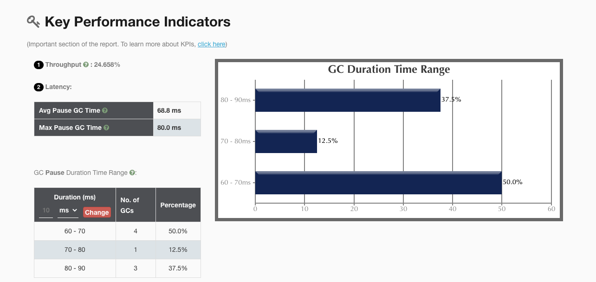
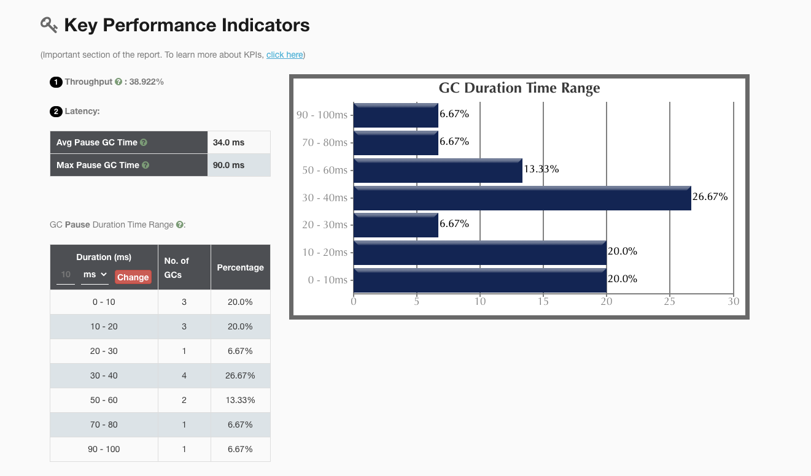
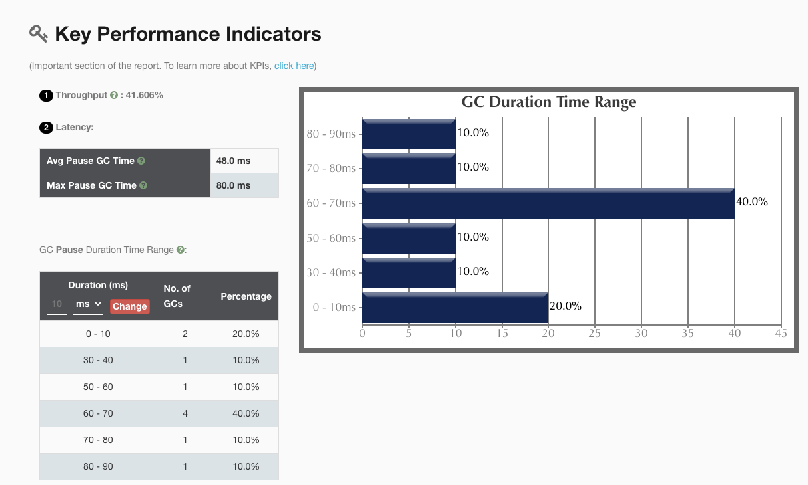
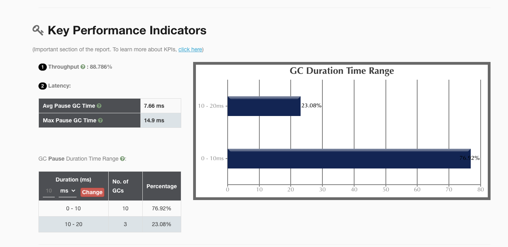

# Project1

> 使用 GCLogAnalysis.java 自己演练一遍串行 / 并行 /CMS/G1 的案例

打印GC详细日志 `-XX:+PrintGCDetails`

GC执行的时间戳 `-XX:+PrintGCDateStamps`

没有设置任何参数情况下的GC 

`java -XX:+PrintGCDetails -XX:+PrintGCDateStamps GCLogAnalysis`

```java
2021-07-05T18:55:21.331+0800: [GC (Allocation Failure) [PSYoungGen: 65270K->10738K(76288K)] 65270K->24782K(251392K), 0.0092695 secs] [Times: user=0.02 sys=0.03, real=0.01 secs]
2021-07-05T18:55:21.352+0800: [GC (Allocation Failure) [PSYoungGen: 76221K->10742K(141824K)] 90265K->49759K(316928K), 0.0129898 secs] [Times: user=0.02 sys=0.05, real=0.01 secs]
2021-07-05T18:55:21.407+0800: [GC (Allocation Failure) [PSYoungGen: 141814K->10747K(141824K)] 180831K->94363K(316928K), 0.0200350 secs] [Times: user=0.03 sys=0.09, real=0.02 secs]
2021-07-05T18:55:21.444+0800: [GC (Allocation Failure) [PSYoungGen: 141819K->10745K(272896K)] 225435K->135993K(448000K), 0.0194471 secs] [Times: user=0.04 sys=0.08, real=0.02 secs]
2021-07-05T18:55:21.463+0800: [Full GC (Ergonomics) [PSYoungGen: 10745K->0K(272896K)] [ParOldGen: 125247K->119946K(248832K)] 135993K->119946K(521728K), [Metaspace: 2737K->2737K(1056768K)], 0.0116110 secs] [Times: user=0.06 sys=0.00, real=0.01 secs]
2021-07-05T18:55:21.556+0800: [GC (Allocation Failure) [PSYoungGen: 262063K->10748K(272896K)] 382010K->199598K(521728K), 0.0271964 secs] [Times: user=0.04 sys=0.11, real=0.03 secs]
2021-07-05T18:55:21.583+0800: [Full GC (Ergonomics) [PSYoungGen: 10748K->0K(272896K)] [ParOldGen: 188850K->175378K(338944K)] 199598K->175378K(611840K), [Metaspace: 2737K->2737K(1056768K)], 0.0131417 secs] [Times: user=0.07 sys=0.01, real=0.01 secs]
2021-07-05T18:55:21.638+0800: [GC (Allocation Failure) [PSYoungGen: 262144K->83040K(563200K)] 437522K->258419K(902144K), 0.0287937 secs] [Times: user=0.04 sys=0.12, real=0.03 secs]
2021-07-05T18:55:21.798+0800: [GC (Allocation Failure) [PSYoungGen: 558688K->100335K(576000K)] 734067K->365485K(914944K), 0.0634752 secs] [Times: user=0.11 sys=0.28, real=0.07 secs]
2021-07-05T18:55:21.861+0800: [Full GC (Ergonomics) [PSYoungGen: 100335K->0K(576000K)] [ParOldGen: 265149K->278107K(468480K)] 365485K->278107K(1044480K), [Metaspace: 2737K->2737K(1056768K)], 0.0214895 secs] [Times: user=0.11 sys=0.02, real=0.02 secs]
2021-07-05T18:55:21.936+0800: [GC (Allocation Failure) [PSYoungGen: 475648K->151369K(1000960K)] 753755K->429477K(1469440K), 0.0624264 secs] [Times: user=0.08 sys=0.22, real=0.06 secs]
2021-07-05T18:55:22.197+0800: [GC (Allocation Failure) [PSYoungGen: 990537K->184824K(1024000K)] 1268645K->558144K(1492480K), 0.2329035 secs] [Times: user=0.15 sys=0.31, real=0.24 secs]
2021-07-05T18:55:22.430+0800: [Full GC (Ergonomics) [PSYoungGen: 184824K->0K(1024000K)] [ParOldGen: 373320K->361210K(574464K)] 558144K->361210K(1598464K), [Metaspace: 2737K->2737K(1056768K)], 0.0342382 secs] [Times: user=0.16 sys=0.01, real=0.03 secs]
执行结束!共生成对象次数:10265
Heap
 PSYoungGen      total 1024000K, used 33732K [0x000000076ab00000, 0x00000007c0000000, 0x00000007c0000000)
  eden space 839168K, 4% used [0x000000076ab00000,0x000000076cbf1220,0x000000079de80000)
  from space 184832K, 0% used [0x000000079de80000,0x000000079de80000,0x00000007a9300000)
  to   space 253440K, 0% used [0x00000007b0880000,0x00000007b0880000,0x00000007c0000000)
 ParOldGen       total 574464K, used 361210K [0x00000006c0000000, 0x00000006e3100000, 0x000000076ab00000)
  object space 574464K, 62% used [0x00000006c0000000,0x00000006d60beb38,0x00000006e3100000)
 Metaspace       used 2744K, capacity 4486K, committed 4864K, reserved 1056768K
  class space    used 291K, capacity 386K, committed 512K, reserved 1048576K
```

根据YoungGC的垃圾收集器（PSYoungGen），Full GC的垃圾收集器（ParOldGen），可知当前java版本（`openjdk version "1.8.0_292"`）默认的垃圾收集器为ParallelGC。

## 串行GC

java -XX:+PrintGCDetails -XX:+PrintGCDateStamps -Xmx1g -Xms1g -XX:+UseSerialGC GCLogAnalysis

```java
2021-07-05T19:08:40.055+0800: [GC (Allocation Failure) 2021-07-05T19:08:40.055+0800: [DefNew: 279616K->34944K(314560K), 0.0640919 secs] 279616K->82780K(1013632K), 0.0641306 secs] [Times: user=0.03 sys=0.03, real=0.06 secs]
2021-07-05T19:08:40.163+0800: [GC (Allocation Failure) 2021-07-05T19:08:40.163+0800: [DefNew: 314560K->34944K(314560K), 0.0761826 secs] 362396K->159396K(1013632K), 0.0762348 secs] [Times: user=0.04 sys=0.04, real=0.08 secs]
2021-07-05T19:08:40.276+0800: [GC (Allocation Failure) 2021-07-05T19:08:40.276+0800: [DefNew: 314560K->34943K(314560K), 0.0707099 secs] 439012K->237137K(1013632K), 0.0707447 secs] [Times: user=0.03 sys=0.03, real=0.07 secs]
2021-07-05T19:08:40.383+0800: [GC (Allocation Failure) 2021-07-05T19:08:40.383+0800: [DefNew: 314559K->34943K(314560K), 0.0644286 secs] 516753K->318544K(1013632K), 0.0645035 secs] [Times: user=0.03 sys=0.03, real=0.06 secs]
2021-07-05T19:08:40.479+0800: [GC (Allocation Failure) 2021-07-05T19:08:40.479+0800: [DefNew: 314559K->34943K(314560K), 0.0718069 secs] 598160K->406329K(1013632K), 0.0718494 secs] [Times: user=0.03 sys=0.04, real=0.08 secs]
2021-07-05T19:08:40.586+0800: [GC (Allocation Failure) 2021-07-05T19:08:40.586+0800: [DefNew: 314559K->34943K(314560K), 0.0625634 secs] 685945K->493247K(1013632K), 0.0626059 secs] [Times: user=0.04 sys=0.03, real=0.06 secs]
2021-07-05T19:08:40.678+0800: [GC (Allocation Failure) 2021-07-05T19:08:40.678+0800: [DefNew: 314442K->34943K(314560K), 0.0716939 secs] 772746K->572092K(1013632K), 0.0717473 secs] [Times: user=0.03 sys=0.03, real=0.08 secs]
2021-07-05T19:08:40.785+0800: [GC (Allocation Failure) 2021-07-05T19:08:40.785+0800: [DefNew: 314559K->34943K(314560K), 0.0592512 secs] 851708K->653396K(1013632K), 0.0592853 secs] [Times: user=0.02 sys=0.03, real=0.06 secs]
执行结束!共生成对象次数:9475
Heap
 def new generation   total 314560K, used 311819K [0x0000000780000000, 0x0000000795550000, 0x0000000795550000)
  eden space 279616K,  99% used [0x0000000780000000, 0x0000000790e62d40, 0x0000000791110000)
  from space 34944K,  99% used [0x0000000791110000, 0x000000079332fff8, 0x0000000793330000)
  to   space 34944K,   0% used [0x0000000793330000, 0x0000000793330000, 0x0000000795550000)
 tenured generation   total 699072K, used 618452K [0x0000000795550000, 0x00000007c0000000, 0x00000007c0000000)
   the space 699072K,  88% used [0x0000000795550000, 0x00000007bb145238, 0x00000007bb145400, 0x00000007c0000000)
 Metaspace       used 2743K, capacity 4486K, committed 4864K, reserved 1056768K
  class space    used 291K, capacity 386K, committed 512K, reserved 1048576K
```



## 并行GC

java -XX:+PrintGCDetails -XX:+PrintGCDateStamps -Xmx1g -Xms1g -XX:+UseParallelGC GCLogAnalysis

```java
2021-07-05T19:10:00.819+0800: [GC (Allocation Failure) [PSYoungGen: 262144K->43509K(305664K)] 262144K->82549K(1005056K), 0.0332031 secs] [Times: user=0.06 sys=0.13, real=0.04 secs]
2021-07-05T19:10:00.891+0800: [GC (Allocation Failure) [PSYoungGen: 305641K->43512K(305664K)] 344680K->150540K(1005056K), 0.0419090 secs] [Times: user=0.07 sys=0.17, real=0.04 secs]
2021-07-05T19:10:00.976+0800: [GC (Allocation Failure) [PSYoungGen: 305656K->43504K(305664K)] 412684K->220370K(1005056K), 0.0317952 secs] [Times: user=0.06 sys=0.09, real=0.03 secs]
2021-07-05T19:10:01.046+0800: [GC (Allocation Failure) [PSYoungGen: 305648K->43504K(305664K)] 482514K->294857K(1005056K), 0.0652453 secs] [Times: user=0.06 sys=0.08, real=0.07 secs]
2021-07-05T19:10:01.150+0800: [GC (Allocation Failure) [PSYoungGen: 305648K->43515K(305664K)] 557001K->372050K(1005056K), 0.0901289 secs] [Times: user=0.08 sys=0.10, real=0.09 secs]
2021-07-05T19:10:01.268+0800: [GC (Allocation Failure) [PSYoungGen: 305659K->43514K(160256K)] 634194K->450596K(859648K), 0.0471087 secs] [Times: user=0.07 sys=0.10, real=0.05 secs]
2021-07-05T19:10:01.330+0800: [GC (Allocation Failure) [PSYoungGen: 160250K->64900K(232960K)] 567332K->477607K(932352K), 0.0071859 secs] [Times: user=0.03 sys=0.01, real=0.00 secs]
2021-07-05T19:10:01.352+0800: [GC (Allocation Failure) [PSYoungGen: 181636K->84648K(232960K)] 594343K->506010K(932352K), 0.0262197 secs] [Times: user=0.03 sys=0.01, real=0.02 secs]
2021-07-05T19:10:01.393+0800: [GC (Allocation Failure) [PSYoungGen: 201174K->99562K(232960K)] 622536K->540495K(932352K), 0.0239294 secs] [Times: user=0.05 sys=0.02, real=0.02 secs]
2021-07-05T19:10:01.435+0800: [GC (Allocation Failure) [PSYoungGen: 216286K->79822K(232960K)] 657219K->569769K(932352K), 0.0360012 secs] [Times: user=0.04 sys=0.06, real=0.04 secs]
2021-07-05T19:10:01.489+0800: [GC (Allocation Failure) [PSYoungGen: 196558K->37198K(232960K)] 686505K->599540K(932352K), 0.0503207 secs] [Times: user=0.05 sys=0.10, real=0.05 secs]
2021-07-05T19:10:01.556+0800: [GC (Allocation Failure) [PSYoungGen: 153855K->33899K(232960K)] 716198K->630556K(932352K), 0.0231236 secs] [Times: user=0.03 sys=0.05, real=0.02 secs]
2021-07-05T19:10:01.579+0800: [Full GC (Ergonomics) [PSYoungGen: 33899K->0K(232960K)] [ParOldGen: 596656K->329777K(699392K)] 630556K->329777K(932352K), [Metaspace: 2737K->2737K(1056768K)], 0.0386679 secs] [Times: user=0.18 sys=0.01, real=0.04 secs]
2021-07-05T19:10:01.633+0800: [GC (Allocation Failure) [PSYoungGen: 116736K->40458K(232960K)] 446513K->370235K(932352K), 0.0042090 secs] [Times: user=0.01 sys=0.00, real=0.00 secs]
2021-07-05T19:10:01.654+0800: [GC (Allocation Failure) [PSYoungGen: 157049K->40662K(232960K)] 486826K->406195K(932352K), 0.0052512 secs] [Times: user=0.03 sys=0.00, real=0.00 secs]
执行结束!共生成对象次数:9908
Heap
 PSYoungGen      total 232960K, used 135224K [0x00000007aab00000, 0x00000007c0000000, 0x00000007c0000000)
  eden space 116736K, 81% used [0x00000007aab00000,0x00000007b0758838,0x00000007b1d00000)
  from space 116224K, 34% used [0x00000007b8e80000,0x00000007bb635ac8,0x00000007c0000000)
  to   space 116224K, 0% used [0x00000007b1d00000,0x00000007b1d00000,0x00000007b8e80000)
 ParOldGen       total 699392K, used 365532K [0x0000000780000000, 0x00000007aab00000, 0x00000007aab00000)
  object space 699392K, 52% used [0x0000000780000000,0x00000007964f7160,0x00000007aab00000)
 Metaspace       used 2744K, capacity 4486K, committed 4864K, reserved 1056768K
  class space    used 291K, capacity 386K, committed 512K, reserved 1048576K
```



## CMS GC

java -XX:+PrintGCDetails -XX:+PrintGCDateStamps -Xmx1g -Xms1g -XX:+UseConcMarkSweepGC GCLogAnalysis

```java
2021-07-05T19:13:22.346+0800: [GC (Allocation Failure) 2021-07-05T19:13:22.346+0800: [ParNew: 279616K->34944K(314560K), 0.0351786 secs] 279616K->81287K(1013632K), 0.0353222 secs] [Times: user=0.08 sys=0.12, real=0.04 secs]
2021-07-05T19:13:22.429+0800: [GC (Allocation Failure) 2021-07-05T19:13:22.429+0800: [ParNew: 314560K->34944K(314560K), 0.0539392 secs] 360903K->156278K(1013632K), 0.0539806 secs] [Times: user=0.08 sys=0.13, real=0.06 secs]
2021-07-05T19:13:22.517+0800: [GC (Allocation Failure) 2021-07-05T19:13:22.517+0800: [ParNew: 314560K->34944K(314560K), 0.0602520 secs] 435894K->237090K(1013632K), 0.0602876 secs] [Times: user=0.30 sys=0.03, real=0.06 secs]
2021-07-05T19:13:22.609+0800: [GC (Allocation Failure) 2021-07-05T19:13:22.609+0800: [ParNew: 314560K->34942K(314560K), 0.0613035 secs] 516706K->310870K(1013632K), 0.0613479 secs] [Times: user=0.25 sys=0.04, real=0.07 secs]
2021-07-05T19:13:22.703+0800: [GC (Allocation Failure) 2021-07-05T19:13:22.703+0800: [ParNew: 314558K->34944K(314560K), 0.0625221 secs] 590486K->382968K(1013632K), 0.0625775 secs] [Times: user=0.23 sys=0.04, real=0.06 secs]
2021-07-05T19:13:22.799+0800: [GC (Allocation Failure) 2021-07-05T19:13:22.799+0800: [ParNew: 314560K->34942K(314560K), 0.0559179 secs] 662584K->459194K(1013632K), 0.0559585 secs] [Times: user=0.27 sys=0.04, real=0.06 secs]
2021-07-05T19:13:22.855+0800: [GC (CMS Initial Mark) [1 CMS-initial-mark: 424251K(699072K)] 465552K(1013632K), 0.0004530 secs] [Times: user=0.00 sys=0.00, real=0.00 secs]
2021-07-05T19:13:22.856+0800: [CMS-concurrent-mark-start]
2021-07-05T19:13:22.859+0800: [CMS-concurrent-mark: 0.003/0.003 secs] [Times: user=0.00 sys=0.01, real=0.00 secs]
2021-07-05T19:13:22.859+0800: [CMS-concurrent-preclean-start]
2021-07-05T19:13:22.860+0800: [CMS-concurrent-preclean: 0.001/0.001 secs] [Times: user=0.01 sys=0.00, real=0.01 secs]
2021-07-05T19:13:22.860+0800: [CMS-concurrent-abortable-preclean-start]
2021-07-05T19:13:22.892+0800: [GC (Allocation Failure) 2021-07-05T19:13:22.892+0800: [ParNew: 314558K->34943K(314560K), 0.0541340 secs] 738810K->541619K(1013632K), 0.0541747 secs] [Times: user=0.30 sys=0.03, real=0.05 secs]
2021-07-05T19:13:22.978+0800: [GC (Allocation Failure) 2021-07-05T19:13:22.978+0800: [ParNew: 314559K->34943K(314560K), 0.0735164 secs] 821235K->624032K(1013632K), 0.0735551 secs] [Times: user=0.32 sys=0.05, real=0.08 secs]
2021-07-05T19:13:23.083+0800: [GC (Allocation Failure) 2021-07-05T19:13:23.083+0800: [ParNew2021-07-05T19:13:23.158+0800: [CMS-concurrent-abortable-preclean: 0.005/0.298 secs] [Times: user=0.98 sys=0.13, real=0.29 secs]
: 314559K->34943K(314560K), 0.0799032 secs] 903648K->711717K(1013632K), 0.0799389 secs] [Times: user=0.28 sys=0.05, real=0.08 secs]
2021-07-05T19:13:23.163+0800: [GC (CMS Final Remark) [YG occupancy: 35015 K (314560 K)]2021-07-05T19:13:23.163+0800: [Rescan (parallel) , 0.0011790 secs]2021-07-05T19:13:23.164+0800: [weak refs processing, 0.0000190 secs]2021-07-05T19:13:23.164+0800: [class unloading, 0.0002621 secs]2021-07-05T19:13:23.164+0800: [scrub symbol table, 0.0004169 secs]2021-07-05T19:13:23.165+0800: [scrub string table, 0.0000992 secs][1 CMS-remark: 676773K(699072K)] 711789K(1013632K), 0.0020570 secs] [Times: user=0.00 sys=0.00, real=0.00 secs]
2021-07-05T19:13:23.165+0800: [CMS-concurrent-sweep-start]
2021-07-05T19:13:23.166+0800: [CMS-concurrent-sweep: 0.001/0.001 secs] [Times: user=0.01 sys=0.00, real=0.00 secs]
2021-07-05T19:13:23.166+0800: [CMS-concurrent-reset-start]
2021-07-05T19:13:23.168+0800: [CMS-concurrent-reset: 0.002/0.002 secs] [Times: user=0.00 sys=0.00, real=0.00 secs]
执行结束!共生成对象次数:9863
Heap
 par new generation   total 314560K, used 118501K [0x0000000780000000, 0x0000000795550000, 0x0000000795550000)
  eden space 279616K,  29% used [0x0000000780000000, 0x0000000785199500, 0x0000000791110000)
  from space 34944K,  99% used [0x0000000793330000, 0x000000079554ff40, 0x0000000795550000)
  to   space 34944K,   0% used [0x0000000791110000, 0x0000000791110000, 0x0000000793330000)
 concurrent mark-sweep generation total 699072K, used 498472K [0x0000000795550000, 0x00000007c0000000, 0x00000007c0000000)
 Metaspace       used 2744K, capacity 4486K, committed 4864K, reserved 1056768K
  class space    used 291K, capacity 386K, committed 512K, reserved 1048576K
```



# G1 GC

java -XX:+PrintGC -XX:+PrintGCDateStamps -Xmx1g -Xms1g -XX:+UseG1GC GCLogAnalysis

```java
2021-07-05T19:47:47.842+0800: [GC pause (G1 Evacuation Pause) (young) 66559K->25959K(1024M), 0.0076528 secs]
2021-07-05T19:47:47.861+0800: [GC pause (G1 Evacuation Pause) (young) 81196K->45236K(1024M), 0.0071021 secs]
2021-07-05T19:47:47.878+0800: [GC pause (G1 Evacuation Pause) (young) 99325K->61909K(1024M), 0.0072033 secs]
2021-07-05T19:47:47.925+0800: [GC pause (G1 Evacuation Pause) (young) 164M->96838K(1024M), 0.0105160 secs]
2021-07-05T19:47:47.950+0800: [GC pause (G1 Evacuation Pause) (young) 188M->128M(1024M), 0.0149404 secs]
2021-07-05T19:47:48.499+0800: [GC pause (G1 Evacuation Pause) (young)-- 889M->630M(1024M), 0.0295906 secs]
2021-07-05T19:47:48.530+0800: [GC pause (G1 Humongous Allocation) (young) (initial-mark) 632M->629M(1024M), 0.0103170 secs]
2021-07-05T19:47:48.540+0800: [GC concurrent-root-region-scan-start]
2021-07-05T19:47:48.540+0800: [GC concurrent-root-region-scan-end, 0.0003049 secs]
2021-07-05T19:47:48.540+0800: [GC concurrent-mark-start]
2021-07-05T19:47:48.550+0800: [GC concurrent-mark-end, 0.0094707 secs]
2021-07-05T19:47:48.550+0800: [GC remark, 0.0051445 secs]
2021-07-05T19:47:48.556+0800: [GC cleanup 668M->662M(1024M), 0.0011365 secs]
2021-07-05T19:47:48.557+0800: [GC concurrent-cleanup-start]
2021-07-05T19:47:48.557+0800: [GC concurrent-cleanup-end, 0.0000314 secs]
2021-07-05T19:47:48.610+0800: [GC pause (G1 Evacuation Pause) (young) 870M->691M(1024M), 0.0079832 secs]
2021-07-05T19:47:48.623+0800: [GC pause (G1 Evacuation Pause) (mixed) 723M->599M(1024M), 0.0078629 secs]
2021-07-05T19:47:48.640+0800: [GC pause (G1 Evacuation Pause) (mixed) 652M->518M(1024M), 0.0087666 secs]
2021-07-05T19:47:48.660+0800: [GC pause (G1 Evacuation Pause) (mixed) 573M->447M(1024M), 0.0076575 secs]
2021-07-05T19:47:48.679+0800: [GC pause (G1 Evacuation Pause) (mixed) 506M->388M(1024M), 0.0121760 secs]
2021-07-05T19:47:48.698+0800: [GC pause (G1 Evacuation Pause) (mixed) 442M->397M(1024M), 0.0056113 secs]
2021-07-05T19:47:48.719+0800: [GC pause (G1 Humongous Allocation) (young) (initial-mark) 504M->427M(1024M), 0.0040397 secs]
2021-07-05T19:47:48.724+0800: [GC concurrent-root-region-scan-start]
2021-07-05T19:47:48.724+0800: [GC concurrent-root-region-scan-end, 0.0001279 secs]
2021-07-05T19:47:48.724+0800: [GC concurrent-mark-start]
2021-07-05T19:47:48.726+0800: [GC concurrent-mark-end, 0.0019740 secs]
2021-07-05T19:47:48.726+0800: [GC remark, 0.0022497 secs]
2021-07-05T19:47:48.729+0800: [GC cleanup 436M->426M(1024M), 0.0009688 secs]
2021-07-05T19:47:48.730+0800: [GC concurrent-cleanup-start]
2021-07-05T19:47:48.730+0800: [GC concurrent-cleanup-end, 0.0000280 secs]
```



---

以下使用针对不同GC的测试情况：

java -Xmx1g -Xms1g -XX:-UseAdaptiveSizePolicy -XX:+PrintGC -jar gateway-server-0.0.1-SNAPSHOT.jar

wrk -c 40 -d30s --latency [http://localhost:8088/api/hello](http://localhost:8088/api/hello)

**SerialGC**

```bash
2 threads and 40 connections
  Thread Stats   Avg      Stdev     Max   +/- Stdev
    Latency    28.12ms   63.97ms 849.56ms   90.63%
    Req/Sec     3.36k     2.38k   11.24k    64.06%
  194664 requests in 30.07s, 23.24MB read
Requests/sec:   6473.47
Transfer/sec:    791.41KB
```

**ParallelGC**

```bash
2 threads and 40 connections
  Thread Stats   Avg      Stdev     Max   +/- Stdev
    Latency    14.36ms   35.57ms 434.38ms   92.28%
    Req/Sec     4.59k     2.23k   11.47k    60.84%
  270945 requests in 30.09s, 32.35MB read
Requests/sec:   9004.32
Transfer/sec:      1.08MB
```

**CMS**

```bash
2 threads and 40 connections
  Thread Stats   Avg      Stdev     Max   +/- Stdev
    Latency    15.37ms   35.50ms 462.98ms   91.55%
    Req/Sec     4.07k     2.06k    9.52k    60.93%
  242415 requests in 30.09s, 28.94MB read
Requests/sec:   8055.88
Transfer/sec:      0.96MB
```

**G1**

```bash
2 threads and 40 connections
  Thread Stats   Avg      Stdev     Max   +/- Stdev
    Latency     1.94ms    2.45ms  76.40ms   93.85%
    Req/Sec    10.04k     1.87k   14.61k    72.32%
  Latency Distribution
     50%    1.32ms
     75%    2.02ms
     90%    3.36ms
     99%   11.01ms
  600208 requests in 30.06s, 71.66MB read
Requests/sec:  19968.95
Transfer/sec:      2.38MB
```

了解了这么多GC算法之后，它们所关心的主要两个指标是**吞吐量**和**暂停时间**。

**吞吐量**：运行用户代码时间 / (运行用户代码时间 + 垃圾收集时间)

**暂停时间**：用户线程暂停的时间

> 注：本次试验仅是单次实验的结果。

**SerialGC**

它的暂停时间比较久，因为是单线程的，并且不是并发进行回收的。

**ParallelGC 与 CMS**

两者都是多线程的垃圾回收器。

两者新生代的回收都是并发，而老年代的回收前者是并行，后者是并发。

可以看出二者侧重点不同，前者是保证吞吐量，后者是保证响应时间。

**G1**

可以发现G1的GC停顿时间特别短，这是由于它的特性所决定，将Young区和Old区分散在整块堆内存中，可以粒度特别细的进行内存回收，但是不可避免的它的吞吐量也会下降。